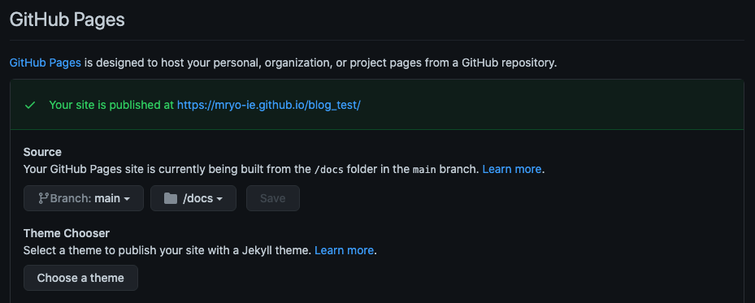

# はじめに（３行説明）
これまで溜めてきた技術メモを、就活も兼ねて、一度どこかにアウトプットしたいと思っていた。
調査してみた結果、hugo + GitHub Pages が一番手っ取り早くて良さそう、という結論に至った。
せっかくなので、このサイトが作られるまでの過程を、最初の投稿のネタにしてみることにした。

# 使用技術
## Hugo
[参考](#参考) や 公式ページ をみた方が早いので、詳細な説明はそちらに譲ります。
### メリット
- 全て無料。
- めちゃくちゃ簡単だった。
- 記事作成について...
  - Markdown がそのまま記事になる。
    - ローカルで編集できるので、VS Code がそのまま使える。
    - スマホでの編集は... 考え中。
  - テンプレが豊富。
  - ブラウザ（ローカル）で、リアルタイムに更新が見れる（お手軽）
  - ビルドもかなり早い
    - 比較はしてないけど...
    - ローカルでは 100ms 以内で終わってた。

## GitHub Pages
こちらも、[参考](#参考) や [公式ページ](https://pages.github.com/) をみた方が早いです。

### メリット
- 全て無料。
- めちゃくちゃ簡単だった。
- 拡張機能について...
  - （未）GitHub Actions と組み合わせて、デプロイ作業を自動化できるらしい。

# Qick Start
## 1. hugo をインストールする。

## 2. テンプレを作る（更新確認）。

## 3. 記事を書く。

## 4. GitHub Pages に公開する。
- いくつか方法がある。
  1. User or organization site（特殊。1 site/アカウント）
     - アカウントにつき１つだけ作れる、専用のリポジトリ（？）
     - `https://【ユーザー名】.github.io` 
  2. Project site（一般的。1 site/リポジトリ）
     - リポジトリごとに、ページを作る。
     - `https://【ユーザー名】.github.io/【リポジトリ名】`
  3. カスタム ドメイン（？） 
     - （未）
- 詳しくは、[公式 Quick Start](https://pages.github.com/) をみるのをオススメ。

今回は、2. Project site（1 site/リポジトリ）で公開しました。

### 4.1 config.toml の baseURL を変更。
### 4.2 GitHub Pages に、doc/ ディレクトリを登録する。
- GitHubリポジトリ > Settings > GitHub Pages
- 

### 4.3 

## 参考
- [GitHub Pages > Project site > Start from scratch](https://pages.github.com/)
- [HugoとGithub Pagesで自作ブログサイトを作ってみる #1](https://qiita.com/BIwashi/items/c011454bdb9a523bba4a)
- [HUGO / Host on GitHub](https://gohugo.io/hosting-and-deployment/hosting-on-github/)
